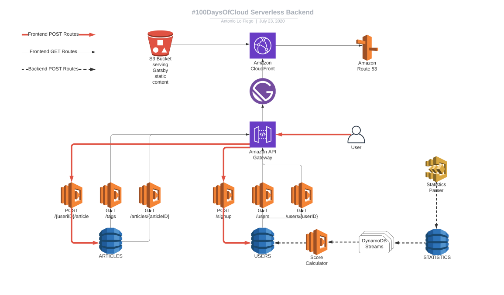

## Info
This repository holds the source truth for the backend architecture of the new 100DaysOfCloud [website](https://100daysofcloud.com) [in development currently]. The infrastructure is fully serverless.

## Architecture diagram


### Branches
All development work happens on the `dev` branch. When changes are operational there, they get merged into the `staging` branch. Once that has been proven working, they get merged into the `main` branch.

### CI/CD & Environments
As seen in the `cicd` folder, the deployment pipeline is done through CodePipeline and CodeBuild, which are integrated into this repository via webhooks. When changes are made for example on the `dev` branch, they get deployed automatically into its respective AWS environment (dev, staging, prod). The setup and workings of this pipeline can be seen in the `cicd` folder and the `buildspec.yml` file. CodeBuild is set up to deploy the infrastructure via [SAM](https://github.com/awslabs/serverless-application-model) based on the contents of the `buildspec.yml` file.

The naming scheme of the stacks deployed is `hdoc-{frontend/backend}-{stage}-{resource}-{randomID}`. An example would be `hdoc-backend-dev-cognito-HF34H2FBJ`. There is no explicit naming of resources, every resource is named automatically by CloudFormation.

The CodePipeline (seen in the `cicd` folder) is manually deployed. When changes are made to it, you have to manually deploy it again with the commands below. The details of the deployment and its stack can be seen in the `cicd/samconfig.toml` file.
```
cd cicd/
sam build -t codepipeline-dev.template.yml
sam deploy -t codepipeline-dev.template.yml --profile mfa
```


## Misc
### MFA
If there is a need for CLI interaction with the 100DaysOfCloud AWS account, you have to authenticate your CLI with MFA credentials. Execute the following command which will return a pair of access keys and a session token. You have to create a profile in your CLI and have it use those credentials. The returned credentials are valid for 12 hours from creation. You have to execute this command with a CLI profile that has access to the account. 

Get MFA credentials example
```
aws sts get-session-token --serial-number arn:aws:iam::{AWS::AccountId}:mfa/{User} --profile User@100daysofcloud --token-code mfa-code-from-device
```

Example entry in the `~/.aws/credentials` file
```
mfa]
aws_access_key_id = example
aws_secret_access_key = example
aws_session_token = example
```

### CodeBuild GitHub authentication errors
Sometimes you'll need to delete the source credentials of the codebuild, this is how you can list them and delete one.
CodeBuild's GitHub integration and authentication is a bit buggy, you might need to reauthenticate if there are ever issues around that. CodeBuild stores the credentials for GitHub in an abstract way, this is how you can list or delete the key. There can be only one authentication present at any given time, you can't authenticate again if it's already authenticated.
```
aws codebuild list-source-credentials --profile mfa --region us-east-1
aws codebuild delete-source-credentials --arn arn:aws:codebuild:us-east-1:{AWS::AccountId}:token/github --profile mfa --region us-east-1
```

### Lambdas with SAM in nested stacks
Most resources in the infrastructure are inside nested stacks. This is for clear seperation and to avoid resource limits per template in the future. However, this shines light on the lack of a feature in SAM, which is recursively building templates with the `sam build` command. This means that SAM will not package the external libraries for Lambda functions that are inside nested stacks. Because each Lambda function has its own `requirements.txt` file, the external libraries have to be manually installed within each folder and SAM will package the whole folder up and deploy. This is solved with a "for loop" in the `buildspec.yml` at the `pre_build` stage where it cycles through the Lambda functions' folders and `pip install -r requirements.txt -t "$PWD"` all of the required packages into their respecitve folders.

For example, the `get_user_by_id` Lambda function requires the external library `simplejson`. The buildspec goes into the folder, installs the libraries inside the folder next to the function's code (`get_user_by_id.py`) and that whole folder will be deployed as one by SAM into the Lambda function.

### Testing
Testing of the Lambda functions happens at multiple stages but with the same process. Each PR gets tested on GitHub with the workflow seen in `.github/workflows/backend-ci.yml` which runs a `pytest` for all of the unit tests.
